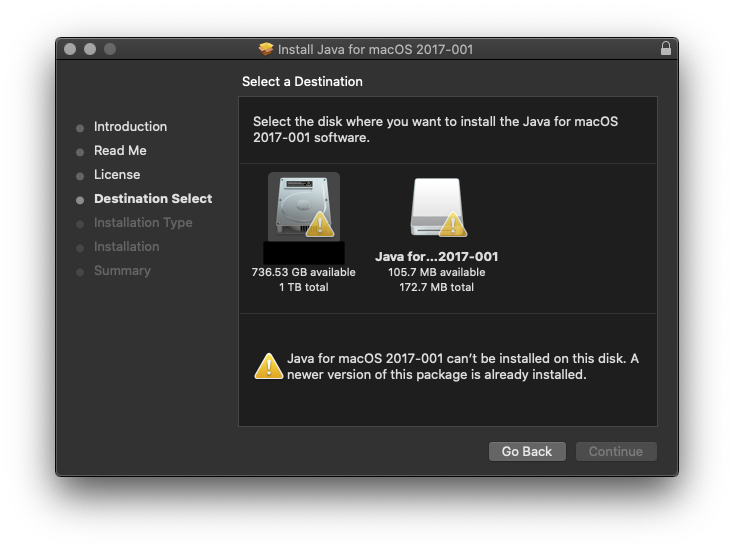

# macOS-Catalina-10.15-Legacy-Java-6-Dependencies

Java 6 cannot currently be installed on macOS 10.15 Catalina because there is a newer version of Java installed on the system. Attempts to reinstall legacy Java libraries upon upgrade of the OS may result in errors restricting installation. Some users have also experienced their previously existing legacy Java libraries have been moved or quarantined. If you are seeing warning icons indicating you cannot place Java onto the disk because a newer version of the package is already installed, such as:



We have found (At [Harris Geospatial Solutions, Inc](https://www.harrisgeospatial.com/Support/Self-Help-Tools/Help-Articles/Help-Articles-Detail/ArtMID/10220/ArticleID/23780/macOS-Catalina-1015-ENVIIDL-and-Legacy-Java-6-Dependencies)) a workaround provided below that has alleviated this issue for some users. This is an unofficial workaround and users should be aware to attempt this with knowledge that it is at their own risk. The workaround creates an AppleScript that removes the installation limits from Java for macOS 2017-001. The AppleScript creates a new modified Java installer package file, JavaPackageforModifiedforCatalina.pkg which should work for installation of Java 6. (NOTE: this article assumes the user has obtained in installed the legacy Java for OS X 2017-001 from Apple Support):

Download the script in [Here](macOS-Catalina-10.15-Legacy-Java-6-Dependencies/macOS-Catalina-10.15-Legacy-Java-6-Dependencies .scpt), build it and run it. It should prompt for the ```JavaForOSX.dmg``` file, select it. The ```ModifiedJava6Install.pkg``` file will automatically save to your desktop. Proceed to install the ```ModifiedJava6Install.pkg``` and once the installation is successful, close the installer. This should work to enable adding legacy Java onto the Catalina Mac OS device, ultimately enabling you to use ENVI/IDL. A reboot should not be required upon completing the steps above.


NOTE: If issues persist, you may also need to reinstall XQuartz 2.7.11 after upgrading to macOS 10.15 Catalina. The suggested workflow can be found in this help article. Basic steps are as follows: 

  A. Reinstall legacy Java using the above workaround suggestion
  B. Reinstall XQuartz 2.7.11
  C. Reboot the machine


Taken from: [Harris Geospatial Solutions, Inc](https://www.harrisgeospatial.com/Support/Self-Help-Tools/Help-Articles/Help-Articles-Detail/ArtMID/10220/ArticleID/23780/macOS-Catalina-1015-ENVIIDL-and-Legacy-Java-6-Dependencies)
